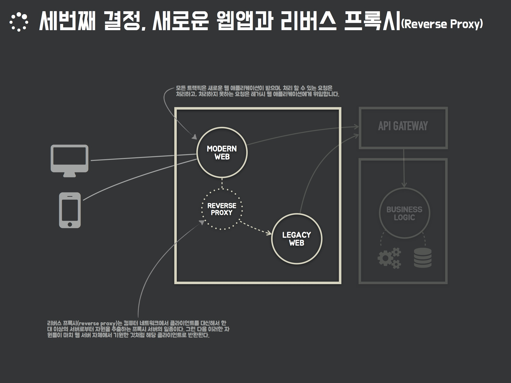

점진적인 레거시 웹 애플리케이션 개선 과정 데모
===================================

아래 장표는 배민찬 레거시 웹 애플리케이션을 개선하는 과정에서 나온 아이디어 중 하나이다. [스트랭글러 패턴](https://docs.microsoft.com/ko-kr/azure/architecture/patterns/strangler)을 기반으로 구상된 아이디어로 새로운 웹앱이 스트랭글러 파사드(Strangler facade) 역할을 내재한 상태로 만들어지고, 리버스 프록시(Reverse Proxy)를 사용해 레거시 웹 애플리케이션과 자연스럽게 연계하는 방식으로 설계했다.  



데모 프로젝트 구조는 다음과 같다.

```
.
├── legacy-web                      # Spring MVC 기반 레거시 웹 애플리케이션 (Boot 를 사용했지만, 없다고 치자!)
│   └── src
├── modern-web                      # Spring Boot, Spring Cloud Netflix Zuul 기반 현대적 웹 애플리케이션 + 스트랭글러 파사드 (신규 웹앱)
│   └── src
├── modern-web-client               # Vue.js 기반 현대적 웹 애플리케이션 클라이언트 
│   ├── node_modules
│   ├── public
│   ├── src
│   ├── babel.config.js
│   ├── package.json
│   ├── vue.config.js
│   └── yarn.lock
├── build.gradle
└── settings.gradle
```

현대적 웹 애플리케이션은 Spring Boot 기반으로 만들어졌다. 클라이언트에 요청이 들어오면 Spring MVC와 [Thymeleaf](https://www.thymeleaf.org/)를 통해 Vue.js로 만들어진 싱글 페이지 애플리케이션(SPA, Single Page Application)을 클라이언트에게 제공한다. 만약 해당 요청을 처리할 수 없다고 판단하면 [Spring Cloud Netflix Zuul](https://cloud.spring.io/spring-cloud-netflix/single/spring-cloud-netflix.html#netflix-zuul-reverse-proxy)을 통해 레거시 웹 애플리케이션에 요청을 전달하고, 응답을 클라이언트에게 돌려준다.

데모 프로젝트 실행하기 위해서는 다음 환경이 필요하다.

- Java 1.8 이상
- Node 8.x 이상
- Yarn 1.9.x 이상

데모 프로젝트를 실행하는 방법은 아래와 같다. (윈도우 환경은 run.sh 파일을 참고해서 실행하길 바란다.)

```
> git clone git@github.com:arawn/continual-improve-legacy-web.git
> cd continual-improve-legacy-web
> ./run.sh stop && ./gradlew clean build && ./run.sh start
```

레거시 웹 애플리케이션에는 3개 페이지가 존재한다.

- http://localhost:9000/index.jsp
- http://localhost:9000/order.jsp
- http://localhost:9000/support.jsp

현대적 웹 애플리케이션에는 1개 페이지와 1개 API가 존재한다.

- http://localhost:9100/order.jsp
- http://localhost:9100/api/items

현대적 웹 애플리케이션은 `/order.jsp` 요청에 대해 Vue.js로 작성된 애플리케이션으로 응답하고, 그외 요청(`/index.jsp, /support.jsp`)은 레거시 웹 애플리케이션에게 전달한다. Vue.js로 작성된 `/order.jsp`에서는 API 호출 후 console.log 를 통해 출력하는 기능이 구현되어 있다.


`점진적인 레거시 웹 애플리케이션 개선 과정`에 대한 전체 이야기는 첨부된 [Presentation](continual-improve-legacy-web.pdf) 에서 볼 수 있다.